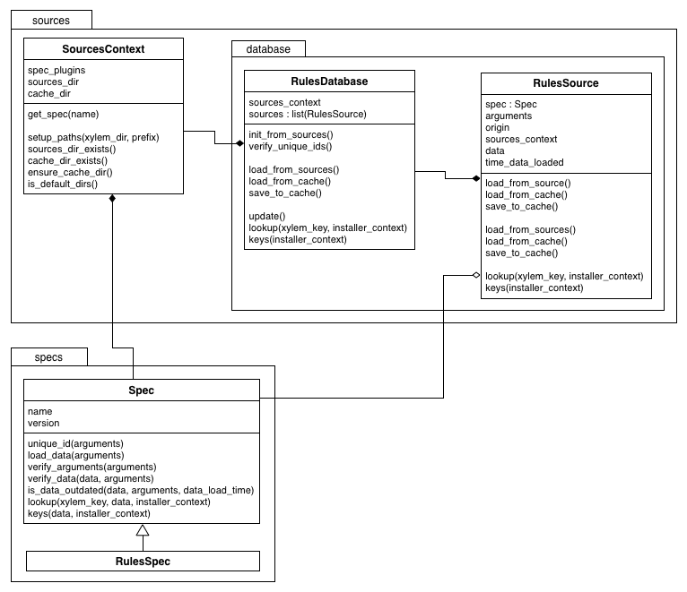

``xylem``'s Design Overview
===========================

Motivation
----------

What is the motivation for developing ``xylem`` as a new tool as opposed
to updating ``rosdep``?

``rosdep`` was originally designed for use with ``rosbuild`` and both
code and command line interface are structured for that purpose. The
notion of stacks, packages and manifests where ``rosdep`` keys were
defined at a stack level is deeply baked into the design. Later
adaptations to work with ``catkin`` were bolted on to that design in a
suboptimal way and it became increasingly hard to extend ``rosdep`` with
new features. Thus, ``rosdep`` has **a lot of unused or overly
complicated code**.

Moreover, ``rosdep`` is currently linked tightly to several other ROS
tools like ``bloom``, such that even minor changes in ``rosdep`` can
have deep ramifications in the tool chain. Due to this fragility,
releases are slow and infrequent. Moreover, ``rosdep`` is not modular
enough to facilitate extensions through third-party python packages.
Together, all this implies that it is extremely **difficult to improve
rosdep, implement new features, and get them released**.

Therefore it was concluded that it be more efficient to start fresh,
borrowing ideas and code from ``rosdep``, but designing it the way it
should be rather than the way it used to be. Hence, ``xylem`` was born.

Goals
-----

``xylem`` is supposed to supersede ``rosdep`` as a package manager
abstraction tool that can be used to install dependencies on any
supported platform in a uniform manner. In particular, the goals of
``xylem`` are the following.

Separation of concerns
~~~~~~~~~~~~~~~~~~~~~~

``xylem`` addresses one of the key shortcomings of ``rosdep``, namely
its tight coupling with other ROS tools, with a modular design that
considers the following building blocks.

- A **core library** that provides the infrastructure to read in rule
  files, resolve keys depending on the user platform and invokes package
  managers to install the desired software.

- A set of **plugins** that provide specific functionality:

  + `operating system support <OS support_>`_ (e.g. Ubuntu, OS X,
    cygwin)
  + `installers <Installers_>`_, e.g. package managers
    (e.g. APT, PIP, Homebrew), but also for example the ``source`` installer.
  + `frontend input <Frontend input_>`_ of keys (e.g. directly from the
    command line or by parsing a directory of ROS packages)
  + `rules specification <Rules specification_>`_ (e.g. rules files or
    released ROS packages from ``rosdistro``)
  + `default sources <Default sources_>`_ (e.g. additional default rules
    files from robot vendors)
  + `command verbs <Commands_>`_ (e.g. ``xylem install``, ``xylem
    update``)

``xylem`` comes with default plugins for all of the above points of
extension.

Extensibility
~~~~~~~~~~~~~

Plugins should be able to extend the core tool from within other Python
packages, such that extensions can be made without the need to touch the
core package. This allows extensions to be developed and distributed
somewhat independently of ``xylem`` releases. General purpose plugins
that have proven to be useful to a range of users should be considered
for inclusion into the core library.

Independence from ROS
~~~~~~~~~~~~~~~~~~~~~

One aim with designing ``xylem`` in a modular and extensible way is
allowing it to be completely independent from ROS. In particular the
core library should not have any ROS specific special cases or
assumptions. Any functionality that is specific to ROS should be
implemented as plugins, and possibly distributed as a separate package
``xylem-ros``.

The ways in which ``rosdep`` is currently tied to ROS are:

- Frontend input, for example by scanning a directory for ROS packages
  and checking / installing their dependencies.
- Extracting resolution rules from ``rosdistro`` information.
- API access from tools like ``catkin``, ``bloom`` or ``catkin_lint``.
- Use of other ROS specific packages, e.g. ``rospkg.os_detect``.

Replace rosdep
~~~~~~~~~~~~~~

One aim for ``xylem`` together with its ROS specific plugins is to
provide a full future replacement for ``rosdep``. This entails providing
command line tools to check and install dependencies of ROS packages as
well as providing an appropriate python API that allows tools such as
``catkin`` or ``bloom`` to query xylem for dependency information. We do
not aim at backward compatibility at the CLI or API level, but at the
level of provided features.

In particular, this also means that the keys currently specified in
package.xml files of ROS packages should continue to work with ``xylem``
(for non-EOL distributions at the very least).

Full backward compatibility in particular to EOL tools such as
``rosbuild`` does *not* have to be achieved.

Consider improvements
~~~~~~~~~~~~~~~~~~~~~

The design of ``xylem`` should consider the known limitations of
``rosdep`` and improve beyond the functionality of ``rosdep``. While
proposed enhancements possibly are not implemented right away, it should
be ensured that future extensions allow their realization without the
need to break backwards-compatibility or for heavy redesign.

The following list of exemplar improvements is not necessarily
exhaustive, nor definitive. More details on some of these ideas can be
found `further blow <Improvements over rosdep_>`_.

- improve rule files

  + smaller backwards-compatible changes, mostly syntactic sugar for
    less repetition for different platforms (``any_version``,
    ``any_os``)
  + support versions in rules files, e.g. parsed from ``package.xml``
    files [`details <Versions in rules files_>`_]
  + support different types of dependencies such as test dependencies
  + support package managers with options (such as formula options on
    homebrew, use flags on gentoo?)
  + consider precedence of conflicting rules [`details <Alternative
    resolutions_>`_]
  + inter-key dependencies [`details <Inter-key dependencies in rules
    files_>`_]

- support package manager sources (e.g. PPAs for APT on Ubuntu)
  [`details <Improved package manager abstraction_>`_]
- support package manager prerequisites (such as PM is installed, PM
  cache is up-to-date, correct PPA is installed) [`details <Improved
  package manager abstraction_>`_]
- support multiple resolution alternatives on the same platform with
  sensible defaults as well as user-configurable arbitration between
  them (e.g. macports vs homebrew, apt vs pip) [`details <Alternative
  resolutions_>`_]
- configure source/cache location and supply working cache with
  installation [`details <Sources and cache location_>`_]
- configure package manager plugins from config/cli (e.g. whether to use
  sudo or not, supply additional command line arguments) [`details
  <Settings and command line arguments_>`_]
- support concurrent invocations of ``xylem``, in particular the
  ``update`` verb for tools such as ``bloom`` running in parallel.
  [`details <Sources and cache location_>`_]
- support automatic cache updates (integrate update with native package
  manager, cronjob, ...)
- support virtual packages and/or ``A OR B`` logic
- support derivative operating systems (e.g. use Ubuntu rules on Ubuntu
  derivatives if no specific rules are available) [`details <Derivative
  operating systems_>`_]
- warn users when ``xylem`` is out of date [`details <Notify user about
  outdated database_>`_]
- version the rules database and force update on version changes
- improve situation on Windows
- support proxies for any downloads as well as for the installer
  invocations, see `ros-infrastructure/rosdep#335`_

.. _ros-infrastructure/rosdep#335: https://github.com/ros-infrastructure/rosdep/pull/335

Anti-Goals
~~~~~~~~~~

``xylem`` does not aim to replace package managers or package software
itself. While support for package-manager-less platforms can be achieved
with installer plugins such as the source installer, it is not an
objective of xylem to systematically maintain such installation scripts.

Supported platforms
-------------------

``xylem`` aims to support at least the following platforms (which is
what ``rosdep`` currently supports) with their native package managers

- arch (pacman)
- windows/cygwin (apt-cyg)
- debian (apt)
- freebsd (pkg_add)
- gentoo (portage)
- opensuse (zypper)
- osx (homebrew, macports)
- redhat (yum)

as well as the following language-specific cross-platform packages
managers

- ruby (gem)
- python (pip)

and a platform independent source installer:

- source

On the wish list is better support for Windows, but it is unclear how
this could be achieved.

Plugins
-------

In order to be modular and extensible by independent Python packages,
``xylem`` uses the `Entry Points`_ concept of ``setuptools``. The
following discusses the pluggable parts of ``xylem`` laid out `above
<Separation of concerns_>`_ in more detail.

.. _Entry Points: http://stackoverflow.com/questions/774824/explain-python-entry-points

OS support
~~~~~~~~~~

Operating system support includes:

- detecting if current OS matches the OS plugin
- detecting the current OS version (or codename)
- specify supported installers, default installer and installer order of
  preference

OS plugins are derived from :class:`xylem.os_support.OS` and
:class:`xylem.os_support.OSSupport` manages the list of os plugins as
well as the current (possibly overridden) os.
:class:`xylem.os_support.OSSupport` is high-level API, but not
necessarily used directly, but rather inside
:class:`xylem.installers.InstallerContext`

**Notes:**

- At the moment OS support plugins are not able to list all versions,
  but only ever detect the current version. The advantage is that no
  code update is necessary for each new OS release. The disadvantage is
  that the list of versions is not available e.g. to verify the
  structure of rules files or to distinguish between package manager and
  version names in rules definitions.

  + *Nikolaus*: I think we should leave it like that for now.
- For each OS plugin we have to choose if we use numbers or code names
  to specify versions. In general we try to use version code-names if
  possible. Version numbers have the disadvantage of being less
  memorable and some care needs to be taken because YAML might parse
  version numbers as floats, not strings. Codenames for some operating
  systems have the disadvantage that they are not in alphabetical order
  (e.g. OS X, debian), meaning the rules definition mappings in YAML are
  not in the chronological OS version order. Moreover, without the OS
  plugins listing the existing versions, version ranges cannot be
  specified because the order of versions is in general unknown. One
  might want to support shortcut notation in rules files like ``ubuntu:
  "lucid - oneric": foo-pkg``.

  + *Nikolaus*: I'm not sure what we can do about this without listing
    the known OS versions. Even if they are known, we would need to have
    this information for formatting and verifying rules files (order of
    version dict).
- Should are OS configuration like registered installers and installer
  order of preference always per-OS as is in ``rosdep``, or do we
  possibly need optional per-version distinction for these?

  + *Nikolaus*: I believe per OS is fine for now.

Installers
~~~~~~~~~~

The supported installers are defined as plugins such that support for
new installers can be added by external Python packages. Installers
typically represent support for a specific package manager like APT, but
not necessarily, as is the case for the source installer. The minimal
functionality an installer needs to provide is:

- check if specific packages are installed
- install packages

Installer plugins are derived from :class:`Installer
<xylem.installers.Installer>`. The list of known installer plugins is
managed by a high-level API context object, the :class:`InstallerContext
<xylem.installers.InstallerContext>`. The
:class:`InstallerContext <xylem.installers.InstallerContext>` uses
:class:`OSDetect <xylem.os_support.OSDetect>` to manage the
detected/overridden OS.

:meth:`setup_installers() <xylem.installers.InstallerContext.setup_installers>`
uses information from user configuration, os plugins and installer
plugins to prepare the list of installers for the current os, their
priorities, as well as the default installer.
The idea is that information about which installer is used when multiple
possible resolutions exist can come from different sources. In the
default case, OS plugins specify which installers are used on that
plugin (including a order of preference through priorities and a default
installer). On top of that platform independent installer plugins can
declare to be used on specific OSs (e.g. all OSs). This allows to write
new installer plugins (e.g. for ``go get``) that are available on
platforms without touching the os plugins. Lastly, the user config can
override all of that (available installers as well as their priorities).

The following are ideas for additional functionality of installer
plugins. It is not quite clear how they are formalized in code. Maybe
just methods that may be defined (duck typing or ABC mixin style). Some
of these (like support for options) can be done transparently (as is
done for homebrew in rosdep), but some require interaction with other
components (e.g. uninstall, native reinstall, versions).

- support uninstall

  + e.g. source installer does not support this

- support native reinstall

  + Use the pm's native reinstall command as opposed to
    uninstall+install
  + *Nikolaus*: is this ever useful?

- support to attempt install without dependencies

  + this would be needed for a ``specified-only`` option to the
    ``install`` command.
  + *Nikolaus*: not sure if we need this at all.

- support package versions

  + check which version of package is installed
  + check if installed package is outdated
  + upgrade installed package to latest version
  + (install specific version of package)

- support cache update

  + check if package manager cache is outdated
  + update cache (like ``apt-get update``) or provide instructions for
    user how to update pm

- support options

  + some package managers additional options supplied when installing a
    package (homebrew, gentoo (use-flags)?)
  + pass correct options to installer
  + check if options for installed package satisfy the requested options
    (e.g. they are superset)

- native dependencies

  + list all package manager dependencies of specific packages
  + the idea is that we let the package manager install the dependencies
    and only issue the install command for the necessary leafs
  + *Nikolaus*: do we need this?

**Notes:**

- We need to allow the configuration to completely disable installers
  (for specific os), e.g. disable macports on OS X (in favour of
  homebrew).
- Can we change the default resolution on OS X based on which of PM
  (macports, homebrew) is installed? With that the resolution depends on
  the system state, which is maybe not so nice.
- See http://www.ros.org/reps/rep-0112.html and
  http://www.ros.org/reps/rep-0111.html

Frontend input
~~~~~~~~~~~~~~

It needs to be possible to extend the way the user passes keys to be
resolved to ``xylem``. The basic usage would be directly passing a list
of keys on the command line or API function. Another input would be
parsing of ROS packages and checking the ``package.xml`` files. Another
one would be a new file format ``.xylem``, which allows non ROS packages
to specify dependencies for convenient installation.

**Notes:**

- *Nikolaus*: I'm not sure yet how exactly those plugins would look.
- Implementing these as new command verbs gives ultimate flexibility,
  but on the other hand it makes much more sense if the standard
  commands like ``install`` or ``check`` can be extended. E.g. ROS
  support plugins for ``xylem`` should be able to provide an option like
  ``--from-path`` for the ``install`` verb.
- For compatibility of different frontends there are the following
  ideas:

  + Either the desired frontend has to be specified at the command line,
    e.g. ``xylem install --frontend=ros desktop_full
    --rosdistro=hydro``, ``xylem install --ros --from-path src``,
  + or the frontends register command line options that are unique, e.g.
    ``xylem install --rospkg desktop_full``,
    ``xylem install --ros-from-path .``,
  + or ``xylem`` can work some magic to find out which frontend the user
    desires, i.e. it determines if the input from the positional command
    line arguments consists of keys, directories, or ROS-packages. For
    directories is checks if they contain ROS packages with
    ``package.xml`` files or ``.xylem`` files. There is an order on
    which frontend takes precedence, which can be overwritten by
    explicitly specifying the frontend.

  + *Nikolaus*: This last alternative might make for the best *just
    works* user experience, but needs to be carefully thought through in
    order to not appear confusing.

Rules specification
~~~~~~~~~~~~~~~~~~~

The ``rosdep`` model for the definition of rules is configured in source
files (e.g. ``20-default-sources.yaml``) that contain the URLs of rules
files (``base.yaml``). Multiple source files are considered in their
alphabetical order. Having multiple files allows robot vendors to ship
their own source files independently of the base install and also allows
to organize the base rules files (e.g. one file for all python packages
rules). ``xylem`` will be using a similar format of source files listing
rules files, with some (mostly) backwards- compatible (and already
implemented) changes to the rules file format (``any_os``,
``any_version``, see :ref:`rules-files`). ``spec`` plugins can define
new types of specifications for rules. The source files indicate which
spec plugin to use for each entry. Right now we can foresee the
following cases that might come as new spec plugins:

- New rules file format that is not compatible with the existing format.

  + This would work in a very similar fashion to the initial
    ``RulesSpec`` spec plugin.

- Rules derived from ``rosdistro``.

  + This rules spec uses the ``rosdistro`` package to derive rules for
    each ROS distro.

The design for the rules sources and spec plugins is as follows:

Spec plugins derive from :class:`Spec <xylem.specs.Spec>`. They define
how rules are specified and at the core provide  ``load_data`` and
``lookup`` methods. The plugin for rules files is :class:`RulesSpec
<xylem.specs.rules.RulesSpec>`

A :class:`SourcesContext <xylem.sources.SourcesContext>` object manages
known spec plugins as well as the location of source and cache files
(default: ``/etc/xylem/sources.d/`` and ``/var/cache/xylem/sources``).
Those locations can be either configured by specifying a ``prefix`` (for
FHS comaptible folder layout) or a ``xylem_dir`` (for layout suitable
for in-home-folder configuration).

The source files are ordered mappings of spec plugin names to arguments.
In the case of the default :meth:`Rules <xylem.specs.Rules>` spec plugin
the arguments are simple the rule file URL. For example:

.. code-block:: yaml

  # Latest rules in new format
  - rules2: 'files://latest/rules/using/new/rules/format/base.yaml'
  # Existing rules in legacy format
  - rules: 'https://github.com/ros/rosdistro/raw/master/rosdep/base.yaml'
  - rules: 'https://github.com/ros/rosdistro/raw/master/rosdep/python.yaml'
  - rules: 'https://github.com/ros/rosdistro/raw/master/rosdep/ruby.yaml'
  - rosdistro:
      rosdistro_url: 'https://github.com/ros/rosdistro...'
      use_ROSDISTRO_URL: yes
      some_more_optional_arguments: '...'

A :class:`RulesDatabase <xylem.sources.database.RulesDatabase>` is
initialized given a ``SourcesContext``. It loads all source files to
create an ordered list of :class:`RulesSource
<xylem.sources.database.RulesSource>` objects. Each ``RulesSource``
references the according spec plugin and arguments from the entry in the
source file. Moreover, cache and meta data are managed by these objects.
The data (== rules specifications) in the ``RulesDatabase`` can be
loaded by invoking the spec plugins. Data and meta information can be
saved to and loaded from cache. During ``lookup``, all ``RulesSource``
objects are considered in order and the result merged. ``lookup``
returns a dictionary mapping installers to installer rules. The
installer priority determines which of the returned installers is
chosen.

A few simplified code examples to illustrate how this all comes together:

.. code-block:: python

  def update(prefix=None):
      sources_context = SourcesContext(prefix=prefix)
      sources_context.ensure_cache_dir()

      database = RulesDatabase(sources_context)
      database.update()

.. code-block:: python

  def lookup(xylem_key, prefix=None, os_override=None):

      sources_context = SourcesContext(prefix=prefix)
      database = RulesDatabase(sources_context)
      database.load_from_cache()

      ic = InstallerContext(os_override=os_override)

      installer_dict = database.lookup(xylem_key, ic)
      return installer_dict

.. code-block:: python

  def resolve(xylem_keys, prefix=None, os_override=None, all_keys=False):

      sources_context = SourcesContext(prefix=prefix)

      database = RulesDatabase(sources_context)
      database.load_from_cache()

      ic = InstallerContext(os_override=os_override)

      if all_keys:
          xylem_keys = database.keys(ic)

      result = []

      for key in xylem_keys:

          installer_dict = database.lookup(key, ic)

          if not installer_dict:
              raise LookupError("Could not find rule for xylem key '{0}' on "
                                "'{1}'.".format(key, ic.get_os_string()))

          rules = []
          for installer_name, rule in installer_dict.items():
              priority = ic.get_installer_priority(installer_name)
              if priority is None:
                  debug("Ignoring installer '{0}' for resolution of '{1}' "
                        "because it is not registered for '{2}'".
                        format(installer_name, key, ic.get_os_string()))
                  continue
              if 'priority' in rule:
                  priority = rule['priority']

              installer = ic.get_installer(installer_name)
              resolutions = installer.resolve(rule)

              rules.append((priority, installer_name, resolutions))

          if not rules:
              debug("Could not find rule for xylem key '{0}' on '{1}' for "
                    "registered installers '{2}'. Found rules for "
                    "installers '{3}'. Ignoring from 'all' keys.".
                    format(key, ic.get_os_string(),
                           ", ".join(ic.get_installer_names()),
                           ", ".join(installer_dict.keys())))
          else:
              rules.sort(reverse=True)
              result.append((key, rules))

      return sorted(result)

**Notes:**

- Should we consider allowing for the possibility of loading parsed (and
  pickled) rules databases with the ``update`` command (for increased
  speed of ``update``)? Here the original rules files would always be
  specified, but a binary version can be additionally added (somewhat
  like in homebrew all formula need to specify the source to build them,
  but some can additionally provide the binary package as a bottle).

  + *Nikolaus*: I believe it actually has little value at the moment.
- Should rules plugins include an abstraction to tell if the database is
  out of date (for a specific URL)? Something like comparing the last-
  changed timestamp of the cached databased with the last-changed
  timestamp of the online rules file. This might be used to speed up
  ``update`` and also to determine whether to remind the user to call
  ``update``.

**Considered design questions:**

- When are the different rules sourced merged (including arbitration of
  precedence)? During update, or while loading the cache database for
  resolution? Do we keep all possible resolutions in the database, or
  only the one that takes highest precedence?
- How is order of precedence defined between different rules plugins?
  Only by the order of the rules files? Do platform support plugins play
  a role in defining the precedence of different installers on a per-OS
  or per-version basis? Can user settings influence the order of
  precedence?
- Do we only support the *cache* model for sources, where a static rules
  database is built with the ``update`` command, but no new information
  is generated upon key resolution? This implies that rules sources that
  query some other database format (rosdistro?) or online sources at
  resolution time are not possible. In particular the ``rosdistro``
  plugin would generate a list of rules for all released packages upon
  ``update`` (and not on-demand upon key resolution).
- What do the rules plugins return? The parsed rules from a given file
  in a (clearly defined) rules database format (something like the
  current ``dict`` database)? In any case the returned data should be in
  some versioned format, to allow future extensions to that format. This
  is probably the same format in which ``xylem`` keeps cached the
  database.

**Not considered for now:**

- It has been considered to include ``source plugins`` that defines the
  format / structure of the source files. We have for now decided
  against it.

Default sources
~~~~~~~~~~~~~~~

The idea with default sources plugins is that robot vendors can provide
additional default sources including prepackaged cache such that even
those default sources work out of the box without initial ``update``.
How exactly this is realized is tightly related to `Sources and cache
location`_.

Commands
~~~~~~~~

The top level command verbs to the ``xylem`` executable should be
plugins. These can pretty much define any new functionality. It is not
quite clear how exactly other plugins can interact with commands, e.g.
frontend plugins should somehow be able to extend the ``install`` verb.

These are the core commands:

- ``update`` to update the rules database

  + If partial updates are supported, where only outdated rules files
    are pulled, there should be an option to force updating everything.
  + Needs to make sure to remove stale database cache files even on
    partial update, which are no longer referenced from the source
    files. Possibly add a ``clean`` command, that wipes the cache
    completely.

- ``install`` to install packages (resolve + dependencies + installer
  prerequisites checking)

  + options: ``--reinstall``, ``--simulate``, ``--skip-keys``,
    ``--default-yes``, ``--continue-on-error``, ``--specified-only``
    (would this mean to not resolve dependencies on xylem level, or also
    stop possible dependency resolution of package manager, if that is
    even possible)

- ``check`` to check if packages installed

  + options: ``--skip-keys``, ``--continue-on-error``, ``--specified-
    only``

- ``init-config`` to initialize config file, ``sources.list.d`` and
  cache (possibly in custom location according to ``XYLEM_PREFIX``). By
  default the built- in default sources / config is copied to the new
  location. Is a no-op with warning if sources / config is present.

  options:

  + ``--from-prefix`` to copy the config/sources that would be used with
    this given prefix
  + ``--from-system`` to copy the config/sources that would be used with
    empty prefix
  + ``--force`` to clear the config/sources even if they are present

These commands for dependency resolution could be useful:

- ``depends`` (options: ``--depth`` where 0 means no limit)
- ``depends-on`` (options: ``--depth`` where 0 means no limit)

There should also be some commands for checking how a key resolves on a
specific operating system, possibly listing alternative resolutions (pip
vs apt) highlighting the one that would be chosen with ``install``. It
should also be possible to determine where these resolutions come from,
e.g. which source files.

- ``resolve`` -> resolve a key for os/version; no dependency resolution
  / prerequisites checking
- ``where-defined``

Maybe something to query/change the configuration:

- ``config`` with the following arguments:

  + ``--list-plugins`` to list all installed plugins (of all kinds)
  + ``--list-sources`` list information about all sources that would be
    considered during update

**Notes:**

- we might want to steal the alias mechanism from ``catkin_tools``, but
  that is maybe low priority, since ``xylem`` command invocations would
  be much less frequent than ``catkin build`` invocations.
- there should be some options that tell the user why some key is needed
  and why it was resolved the way it was resolved

Improvements over rosdep
------------------------

In the following we elaborate on some of the concrete improvements over
``rosdep`` listed `above <Consider improvements_>`_. Some of them are
far future, some should be implemented right away.

Sources and cache location
~~~~~~~~~~~~~~~~~~~~~~~~~~

The ``xylem`` model of a lookup database cache that is updated with and
``update`` command is somewhat analogous to ``apt-get``. By default a
system-wide cache is maintained that needs to be updated with ``sudo``.
We assume that many developer machines are single-user and/or are
maintained by an admin that ensures regular ``update`` invocations (e.g.
cronjob).

On top of the general scenario the following specific use-cases need to
be supported with regards to the database cache:

- ``xylem`` needs to allow users to maintain their own cache in their
  home folder and use ``xylem`` independent from the system-wide
  installation and without super user privileges.
- Robot vendors need to be able to add to the default sources
  independently from the core ``xylem`` install and without post-
  installation work.
- ``xylem`` needs to be functional out of the box after installation.
  ``update`` requires internet connectivity, which is not given in some
  lab/robot environments. Therefore we need to make sure that ``xylem``
  can be packaged (e.g. as debian) with a pre-generated binary cache.
  This needs to be possible for the default sources bundled with
  ``xylem`` as well as vendor supplied additional source files.
- Tools like ``bloom`` need to be able to create temporary caches
  independent from the system wide install and without super-user
  privileges.

We propose the following solution:

- Firstly, we assume that each URL/entry in the source files has it's
  own binary database cache file, all of which get merged upon lookup.
- The user can specify the ``XYLEM_PREFIX`` environment variable
  (overwritten by a command line option, maybe ``--config-prefix`` or
  ``-c``). By default an empty prefix is assumed.
- The cache will live in ``<prefix>/var/cache/xylem`` and the sources in
  ``<prefix>/etc/xylem/sources.d/``. I.e. the default system wide
  cache/source location is ``/var/cache/xylem`` /
  ``/etc/xylem/sources.d``, but the user can configure it to locally be
  e.g. ``~/.xylem/var/cache/xylem`` / ``.xylem/etc/xylem/sources.d``.
- A xylem installation comes bundled with default source files and
  default cache files. However, in particular the cache is not installed
  into the ``/var/cache`` location directly.
- The ``init`` command installs the default sources and default cache
  into the corresponding locations. There are command line options to
  copy existing sources/cache from another prefix, but by default the
  built-in files are used. The source files are only installed if they
  are not present. The cache files are only installed, if the
  corresponding source file was either not present, or was present and
  identical to the default. Existing cache files are not overwritten.
  There is a flag (maybe ``--force``), that causes it to overwrite the
  default files (sources and cache). Additional source files/cache files
  are not overwritten.
- ``init`` is called as part of the post-installation work at least for
  debians, maybe also pip? Note that this does not require internet
  connection and sets up a working config and cache.
- The default source files could be handled as `conffiles
  <http://raphaelhertzog.com/2010/09/21/debian-conffile-configuration-
  file-managed-by-dpkg/>`_ in the debians, such that they are updated
  upon ``apt-get upgrade``, where the user is queried what should happen
  if he has changed the default sources.
- ``update`` does not automatically use the the built-in sources if none
  exist under the given prefix. However, if the default source files do
  not exist, it warns the user and possibly tells him to call ``xylem
  init`` (or even offers to call it). This warning can be disabled in
  the settings for users that want to explicitly delete the default
  config files.
- Robot vendors that want to supply additional default sources can hook
  into ``init`` (with an entry point) and register their additional
  default sources as well as binary caches. All the above mechanisms
  work for those vendors. For example, if the additional vendor package
  gets installed, a subsequent post-install ``init`` does recognize the
  missing caches for installed default sources and installs them to
  ensure out-of-the-box operation. Likewise, calling ``update`` in a
  custom prefix after installing an additional vendor package will warn
  the user, that some of the default sources are not installed and urge
  her to call ``init``, which will add these additional default sources
  (and cache files), while not touching the existing default source
  files from the core library.

For ``rosdep``, there is `pull request <https://github.com/ros-
infrastructure/rosdep/pull/312>`_ for a slightly different solution.
However, what we suggest addresses some of the remaining issues:

- (re-)installing from debs does not overwrite existing cache files.
- python2 and python3 debians can be installed side-by-side (at least if
  the default source files are not handled as conffiles)

**Notes:**

- Should it be ``sources.list.d`` or ``sources.d``? Note that we
  probably change the source files from ``.list`` to ``.yaml``, so does
  ``sources.list.d`` still make sense?
- Can we ensure that the binary (pickled) database format is compatible
  between python2 and python3?
- If the default files have been updated, and the user updates the xylem
  installation, init will not change the existing default sources. Do we
  need to / can we detect if they are unchanged and replace them
  automatically if they are unchanged? If they are changed, ask the user
  what to do (like debian conffile).
- Do the API calls respect the ``XYLEM_PREFIX`` environment variable or
  need explicit setting of a ``prefix`` parameter? I think the latter.

  + *Dirk:* For rosdistro we actually do the first approach -
    the environment variable ROSDISTRO_INDEX_URL is also used for API
    calls (if not overridden by passing a custom index url). I think
    that approach has the advantage that any tool using rosdistro will
    use the custom url when it is defined in the environment.

    Wouldn't it be kind of unexepcted if the command line tool xylem
    uses the prefix from the environment but a different tools like
    bloom falls back to a different default? Then you would also lack a
    way to override the prefix for any tool using the API (or that tool
    would need to expose a custom way to override the prefix).
- It was mentioned that the debian install needs to work out-of-the-box
  "without any post-installation work". Why exactly? Is post-install
  work (like calling ``init``) ok if it does not require internet
  connectivity?
- Maybe the system wide settings file is also affected by
  ``XYLEM_PREFIX``, i.e. lives in ``<prefix>/etc/xylem/config``?
- When using a user-local cache, locations like
  ``~/.xylem/var/cache/xylem`` / ``.xylem/etc/xylem/sources.d`` are
  somewhat suboptimal. If we want something like ``~/.xylem/cache`` /
  ``.xylem/sources.d``, we would likely need separate ``XYLEM_SOURCES``
  and ``XYLEM_CACHE`` environment variables instead of or alternative to
  ``XYLEM_PREFIX``.
- Additional default sources could also be realized as plugins, which
  provide source files as well as pickled cache files.

Settings and command line arguments
~~~~~~~~~~~~~~~~~~~~~~~~~~~~~~~~~~~

There should be a canonical way to supply arguments to ``xylem``. We
propose a system config file, a user config file and command line
options. The order of precedence of arguments specified multiple times
is::

  command line > user > system

We use ``yaml`` syntax for the configuration files, and suggest the
following locations:

- system: ``<prefix>/etc/xylem/config.yaml``
- user: ``$HOME/.xylem.yaml``

In general all options should be supported both by the CLI and the
config files (where it makes sense). One exception is the environment
variable ``XYLEM_PREFIX``, because this configures the location of the
system-wide config file in the first place.

Command line arguments can be grouped in the following way:

- global command line arguments applicable to all commands such as
  ``disable-plugins`` or ``os``

- command specific command line arguments

- In order to achieve a good user experience, the command specific
  options should be further grouped. For example, all commands that take
  a list of keys as arguments, should do so in the same way, e.g.
  offering ``skip-keys``)

It has to be seen if and how either or both kinds of arguments can be
injected by plugins (e.g. frontend plugins inject new arguments to all
commands that take a list of keys as input).

In particular it needs to be possible to supply arguments to the
installer plugins (e.g. ``as-root`` or ``additional-arguments``, see
`rosdep#307 <https://github.com/ros-
infrastructure/rosdep/pull/307#issuecomment-36572637>`_). ``yaml``
format gives a lot of flexibility, but there should also be some
conventions (not necessarily enforced) to ensure that the plugins name
their options in a uniform way, such that it may even be possible and
reasonable to pass certain options to all installer plugins.

**Notes:**

- Should user file be in ``$HOME/.config/xylem.yaml``, or even
  ``$HOME/.config/xylem/config.yaml`` (see `stackexchange.com
  <http://unix.stackexchange.com/questions/68721/where-should-user-
  configuration-files-go>`_)? What about config locations on Windows?

Inter-key dependencies in rules files
~~~~~~~~~~~~~~~~~~~~~~~~~~~~~~~~~~~~~

In general, we rely on the package manager to install
dependencies for resolved keys. Dependencies between keys in rules files
is at the moment only used for the interplay between homebrew and pip on
OS X it seems. Should this be a general feature for rules to depend on
other keys? In particular if we reactivate the source installer this
would be needed. In particular when considering adding versions to the
rules files, doing dependency resolution right is not quite trivial I
guess.

Dependencies on other keys might be reasonable on different levels.
Currently they are part of the installer section, but maybe they could
be defined also at the rule level.

Notify user about outdated database
~~~~~~~~~~~~~~~~~~~~~~~~~~~~~~~~~~~

Ideally, if the source plugins can tell when they are outdated, we would
fork a process on every invocation to check if database is out of date
and inform the user that an update would be good on the next run. Maybe
limit the update check to only fire if the database has not been updated
for a certain amount of time (a day, a week, could be customizable).

Derivative operating systems
~~~~~~~~~~~~~~~~~~~~~~~~~~~~

OS support e.g. for Ubuntu derivatives should be able to reuse most of
the rules for Ubuntu, but maybe overwrite certain rules. We have started
considering this by letting OS pluings define a list of increasingly
specific names. E.g. a `Xubuntu` os support plugin might define the
names ``["Debain", "Ubuntu", "Xubuntu"]``.

Versions in rules files
~~~~~~~~~~~~~~~~~~~~~~~

In general the user should expect a command ``xylem install boost`` to
install the latest version of ``boost`` on the given system, i.e. on
Ubuntu the version that ``apt-get install boost`` would install. For
some package managers, like apt for a specific Ubuntu release, this
might be always the same version of boost, for other package managers
such as pip or homebrew, this will always refer to the latest version.
This gives rise to two challenges with respect to software versions.
Firstly, at any given time the key ``boost`` refers to different
versions of the boost library on different platforms. Secondly, at two
different points in time the key ``boost`` refers to two different
versions of the boost library on the same platform. These challenges
need to be taken into consideration, since the goal of ``xylem`` is to
allow specification of dependencies in a uniform way that is robust over
time, i.e. can be supplied as part of install instructions today and
still be valid tomorrow.

At the moment, ``rosdep`` does not really consider versions, which users
find confusing in particular in conjunction with ROS packages that may
specify versioned dependencies (`rosdep#325 <https://github.com/ros-
infrastructure/rosdep/issues/325>`_).

In general we assume that package managers can only install one version
of a specific package at a time (largely true for apt, homebrew, pip).
We also assume that we never install a specific version of a package
with the package manager, but only the latest version, or possibly
upgrade an already installed package to the latest version.
Nevertheless, the package manager should be able to tell us, which
version of a package is installed and which version would be
installed/upgraded (i.e. the latest version on that platform).

For some libraries multiple incompatible major versions need to be
present at the same time. Here ``xylem`` follows suite with package
managers such as apt and homebrew and introduces new keys for the
specific versions (as ``rosdep`` does currently). For example, for Eigen
there are the version specific ``eigen2`` and ``eigen3`` keys, as well
as a general ``eigen`` key that points to the latest version (i.e. is
currently the same as ``eigen3``).

What could be considered, is that ``xylem`` allows for input keys to be
associated with version requirements (==, <=, >= etc) and then check, if
the installed or would-be installed version matches. This would solve
the use case with ROS packages above, where there is a one-to-one
relation between xylem key and apt package. However, it is unclear how
the version is handled if a key resolves to 0 or more than 1 packages.
However, the most we would offer in terms of action is upgrading an
already installed package to the latest version, and informing the user
if a matching version cannot be achieved by upgrading or if the version
requirements are incompatible themselves (i.e. user installs foo and
bar, which depend on baz>1.0 and baz<1.0 respectively). Special care
needs to be taken to correctly merge multiple versioned resolutions of
the same key.

Another level of support for versions in rules would be to allow the
resolution rules themselves to be conditional on a version, e.g.
allowing to specify that ``eigen`` would resolve to ``libeigen2-dev`` or
``libeigen3-dev``, depending on the version. With this, the versioned
key ``eigen==2`` and ``eigen==3`` could be resolved at the same time.
Things could get really complicated and I'm not sure we want to go down
that route unless there is a good concrete use case where this is
beneficial.

**Notes:**

- check how package managers deal with versions, in particular the
  capabilities (install multiple version of same package, install
  specific version of package not only latest) and syntax for versioned
  dependencies

  + apt
  + homebrew
  + pip: `<https://pip.pypa.io/en/latest/user_guide.html#requirements-
    files>`_, `<http://pythonhosted.org/setuptools/setuptools.html
    #declaring-dependencies>`_
  + python versions:

    * http://legacy.python.org/dev/peps/pep-0386/
    * http://pythonhosted.org//kitchen/api-versioning.html

- interesting blog about abstract vs concrete dependencies in python
  `<https://caremad.io/blog/setup-vs-requirement/>`_

Improved package manager abstraction
~~~~~~~~~~~~~~~~~~~~~~~~~~~~~~~~~~~~

[TODO: these are only random thoughts. transform them into a coherent
and comprehensible description]

- support stuff like custom ppa's for apt, taps for homebrew
- the ros-ppa should not be special in xylem
- possibly specified on a per-rules-file basis? (identify real world use
  cases / needs)
- if custom ppa's are supported, provide tools to list the ppa's for
  bunch of keys / rules sources
- rules should never specify the ppa location, but rather have some sort
  of names prerequisite. this way the user could configure/overwrite the
  prerequisite in the config file if he e.g. has a customized mirror of
  that ppa or tap.
- issue of trust for the user (auto add alternavte pm sources? query
  user?)
- issue of reliability of sources for the maintainer

  + tool support to ensure ROS core packages are only using ubuntu or
    osrf ppa?

- maybe the right abstraction is *package manager prerequisites*

  + possibly not support undoing these prerequisites
  + prerequisites should be performed before any packages is installed
  + could query user or be automatic (with explicit option) or fail with
    instructions to user
  + allow user to configure and also skip specific or all prerequisite
    checks.
  + special prerequisite is the 'availability', which checks if the pm
    is installed. This should be treated specially, because maybe the
    selection of used package manager should depend on which is
    installed (e.g. macports vs homebrew). Ability to list available
    package managers
  + maybe with the previous it makes sense to distinguish general
    prerequisites (apt is installed and possibly up-to-date) and per-key
    prerequisites (certain ppa is installed)
  + concrete examples:
    * apt: ppa installed
    * source installer: tools installed (gcc etc)
    * brew: homebrew installed, Tap tapped, brew --prefix on PATH
    * pip: pip installed

Alternative resolutions
~~~~~~~~~~~~~~~~~~~~~~~

Allow for alternatives with resolutions on a specific platforms, e.g.
the use can choose macports vs homebrew on OS X, or to use pip over apt
for python packages on Ubuntu.

**Notes:**

 - multiple resolutions for one key on a specific os/version
 - how to do the right thing by default? (e.g. detect if either homebrew
   or macports is installed to determine the default. Maybe some people
   never want to fallback to macports, maybe some want to fall back to
   macports if a key is not defined for homebrew)
 - have preferred order of the different alternatives, customizable (at
   what granularity?)
 - for debian releases only apt dependencies are allowed, for stuff like
   homebrew we can also depend on pip / gem
 - per rules file or per key
 - ``xylem resolve`` command should list all alternatives and help to
   arbitrate

Random points
~~~~~~~~~~~~~

- bring back the source installer
- improve windows situation; possibly source installer? windows 8 app
  store :-)
- integrate/interact with http://robotpkg.openrobots.org somehow? Check
  their solution for ideas for xylem.
- continue on error option for ``install``
- authority on rules and versions
- restriction on the characters used in xylem keys, os names, installer
  names, version strings: alphanumeric, period, dash, underscore. Is
  this too restrictive? Reserved names such as any_os, any_version,
  default_installer...
- for the rosdistro plugin, there should be a more meaningful error
  message when an operating system is not supported (it should not just
  be "key not resolved", nor should it simply try to install non-
  existent packages (and fail) like it does now on homebrew)
- before releasing, carefully consider security and ability for plugins
  to override completely what is installed from sources

- consider migration path ros-package -> system dependencies (in light
  of xylem supporting multiple ros distros)
  http://answers.ros.org/question/173773/depend-on-opencv-in-hydro/

- Look at Chef cookbook
  http://answers.ros.org/question/174507/is-there-interest-in-maintaining-chef-cookbooks-for-ros/

Terminology
-----------

[TODO: Define terms]

- xylem key
- key database
- rules file
- installer
- package manager
- platform --> os/version tuple
- installer
- installer context
- package -> pm package
- rules dict, os dict, version dict, installer dict, installer rule
- rules database (contains merged rules dict)
- rules source (entry in sources file, contains spec plugin name and
  data, typically url, must should have unique identifier)
- cache -> version, datetime, must be reproducible for the unique
  identifier

